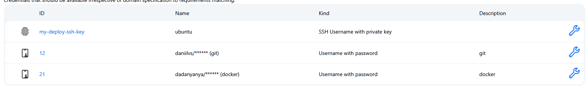
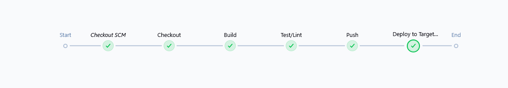

## Локальный запуск
### 1. Установить docker, docker-compose по инструкции
https://docs.docker.com/engine/install/

### 2. Клонировать репозиторий
```
git clone git@github.com:daniilvs/flask_api.git
cd flask_api
```

### 3. Добавить переменные окружения на основе шаблона
```
cp .env.example .env
```

### 4. Запустить docker-compose
```
docker-compose up -d
```

### 5. Убедиться в работоспособности можно следующими командами:
```
curl http://127.0.0.1:5000/ping
curl -X POST http://127.0.0.1:5000/submit -H "Content-Type: application/json" -d '{"name": "Jerma", "score": 100}'
curl http://127.0.0.1:5000/results
```

## CI/CD Jenkins с устновкой на удаленную машину 
### 1. Устновить плагины Jenkins
- Docker Pipeline
- SSH Agent

### 2. Добавить credentials в Jenkins для подключения по ssh, docker-hub


### 3. Настроить и запустить pipeline из Jenkinsfile


### 4. Проверить работоспособность на целевой машине
http://37.9.53.210:5000/results